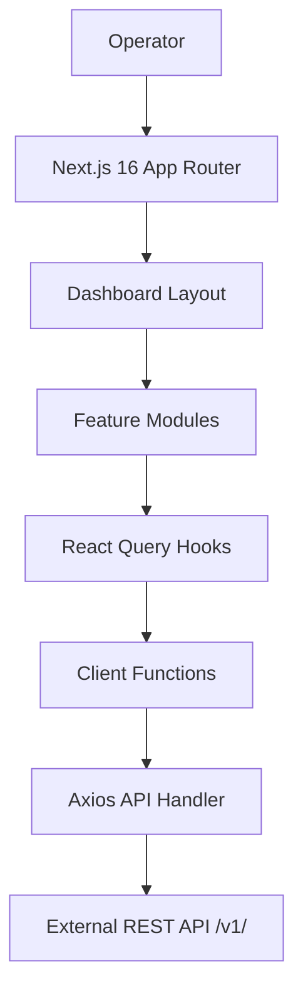

# Architecture

## Tech stack

- **Framework:** Next.js 16 (App Router) with React 19
- **Data fetching:** TanStack React Query v5 for server state; URL query params for UI state (active tab, search, pagination, date range)
- **HTTP client:** Axios with request interceptors for Bearer token injection and response interceptors for 401/403 redirect to logout
- **Forms:** React Hook Form with Zod schema validation
- **UI:** Tailwind CSS v4, custom shared component library (DataTable, modals, forms, badges, skeletons)
- **Auth:** Cookie-based JWT token (`js-cookie`), validated by the dashboard layout on every navigation

## Data flow



## Project structure

```
src/
├── app/                      # Next.js App Router pages
│   ├── (dashboard)/          # Authenticated dashboard routes
│   │   ├── page.tsx          # Home
│   │   ├── asset-loans/      #   /asset-loans, /asset-loans/[id]
│   │   ├── asset-management/ #   /asset-management, /asset-management/[assetClassId],
│   │   │                     #   /asset-management/user-portfolios/[portfolioId]
│   │   ├── customers/        #   /customers, /customers/[id]
│   │   ├── growth-marketing/
│   │   ├── help-support/
│   │   ├── marketplace/
│   │   ├── payments-settlements/
│   │   ├── portfolio-management/
│   │   ├── risk-management/
│   │   ├── smart-contracts/
│   │   └── system-settings/  #   /system-settings, /system-settings/[id]
│   ├── auth/                 # Login, reset password
│   └── logout/
├── components/               # Shared UI components
│   ├── dashboard/            #   Page header, sidebar, stat cards, charts
│   ├── modal/                #   Modal shell, confirm dialogs, success modals
│   ├── table/                #   DataTable, base table, search, column builders
│   ├── ui/                   #   Low-level primitives (Button, Input, Select, Badge…)
│   └── providers/            #   React Query provider
├── module/dashboard/         # Feature/business modules (one directory per domain)
│   ├── home/
│   ├── customers/
│   ├── marketplace/
│   ├── asset-management/
│   ├── asset-loans/
│   ├── asset-verification/
│   ├── smart-contracts/
│   ├── risk-management/
│   ├── payments-settlements/
│   ├── growth-marketing/
│   ├── help-support/
│   ├── portfolio-management/
│   └── system-settings/
├── services/                 # API integration layer
│   ├── api-handler.ts        #   Axios instance, auth interceptors
│   ├── route/                #   Endpoint path definitions
│   ├── client/               #   fetch* async functions (GET requests)
│   ├── queries/              #   use* React Query hooks (reads)
│   └── functions/            #   use*Fns mutation hooks (writes)
├── types/                    # TypeScript type definitions
├── schema/                   # Zod validation schemas
├── hooks/                    # Shared hooks (URL query, debounce, date range)
├── util/                     # Utilities (storage, route paths, error messages)
├── config/                   # App configuration (API URL from env)
└── lib/                      # cn() classname utility
```

## Feature modules

| Module | Route | Description |
|--------|-------|-------------|
| **Home** | `/` | Dashboard overview — inflow/outflow, asset inventory, customer counts, risk alerts, recent activity |
| **Customers** | `/customers` | Registered customers list, customer detail with portfolio, session logs, blacklist |
| **Marketplace** | `/marketplace` | LuxFi listings, customer listings, liquidation/buy offers, P2P trades, audit log |
| **Asset Management** | `/asset-management` | Asset classes, categories, individual assets, user portfolios, verification logs |
| **Asset Loans** | `/asset-loans` | Loan requests, repayments, disbursements, activity logs; loan detail view |
| **Smart Contracts** | `/smart-contracts` | Active contracts, locked collateral, auto-liquidation, market asset prices |
| **Risk Management** | `/risk-management` | Portfolio LTV, exposure concentration, liquidation metrics, collateral trends |
| **Payments & Settlements** | `/payments-settlements` | Sales/purchases history, loan repayments/disbursements, wallet deposits, interest |
| **Growth & Marketing** | `/growth-marketing` | User acquisition, location distribution, inflow/outflow, leads and sales |
| **Help & Support** | `/help-support` | Support tickets, password reset requests |
| **System Settings** | `/system-settings` | Team management, roles & permissions; member detail with activity/session logs |
| **Portfolio Management** | `/portfolio-management` | ⚠️ Deprecated — scheduled for deletion. Portfolio inventory, asset brands, asset categories |

## Module conventions

Each module follows a consistent internal structure:

```
module/dashboard/<name>/
├── index.tsx           # Page component (named export, e.g. CustomersDashboard)
├── data.ts             # Types, tab configs, status maps, mock/seed data
└── components/         # Module-specific components
    ├── <name>-metrics.tsx
    ├── tab-table-components.tsx
    ├── tables/         # Table components per tab
    ├── modals/         # Create/edit/action modals
    └── ...
```

### Page pattern

Module pages use `useURLQuery` for URL-based state management — the active tab, search query, page number, and date filters are all stored as URL search params. This makes every view shareable and bookmarkable.

```tsx
export function CustomersDashboard() {
  const { value, setURLQuery } = useURLQuery<CustomersQuery>();
  const activeTab = isCustomersTab(value.tab) ? value.tab : DEFAULT_CUSTOMERS_TAB;
  const ActiveTabContent = CUSTOMERS_TAB_COMPONENTS[activeTab].slots.content;
  // ...
}
```

### Tab table components pattern

Each tab maps to a `content` slot component (the table), and optionally an `action` slot (the Add/Create button). These are resolved through a `TAB_COMPONENTS` record keyed by tab value.

### DataTable pattern

The shared `DataTable` component (from `@/components/table`) uses TanStack Table under the hood and provides:
- Skeleton loading rows (auto-generated from column count and page size)
- Empty state messaging
- Server-side pagination via `TablePagination`
- Optional checkbox row selection
- Optional sticky action column

## API architecture

The API integration layer follows a consistent 3-layer pattern documented in [ADR 0004](adr/0004-api-integration-architecture.md).

### Layer overview

```
src/services/
├── route/<domain>.route.ts       # Endpoint URL constants
├── client/<domain>.fns.ts        # fetch* async GET functions
├── queries/<domain>.queries.ts   # use* React Query hooks
└── functions/<domain>.fns.ts     # use*Fns mutation hooks
```

### Reference implementation

The Asset Management module (`src/services/` files prefixed `asset-management`) is the canonical example of a complete integration — route definitions, client functions for 6 endpoints, 7 query hooks, and mutations for create/update/delete across 4 resource types (classes, categories, assets, image uploads).

### Adding a new API integration

1. **Define routes** — add a `<Domain>Route` object in `src/services/route/`
2. **Add types** — request payloads, response wrappers, domain types in `src/types/`
3. **Add client functions** — `fetch*` functions in `src/services/client/`
4. **Add query hooks** — `use*` hooks in `src/services/queries/`
5. **Add cache keys** — extend `keyFactory` in `src/util/query-key-factory.ts`
6. **Add mutation hooks** (if needed) — `use<Domain>Fns` in `src/services/functions/`
7. **Connect UI** — replace mock data imports with query hooks in the module

### Key conventions

- **Auth** is handled transparently by `api-handler.ts` — token from cookies, 401/403 redirect to logout. Client functions and hooks never manage auth directly.
- **Error handling** — `getErrorMessage()` extracts detail from Axios errors; toasts display errors. Query-level errors are suppressed (`throwOnError: false` in QueryClient).
- **Cache invalidation** — mutations invalidate the domain's `all` key. No optimistic updates.
- **Pagination** — paginated endpoints return `PaginatedApiResponse<T>` (wrapping `ApiPagination`). The DataTable component accepts `totalEntries` and `pageSize`.
- **URL query state** — tab, search, page, and date filters are stored in URL search params via `useURLQuery`.
- **Read-only vs read-write domains** — modules that are purely dashboards (Risk Management, Growth & Marketing) only need layers 1-3 (route, client, queries). Modules with CRUD operations also need layer 4 (mutation hooks).
- **Client functions** are named `fetch*` and live in `src/services/client/`. **Mutation hooks** are named `use<Domain>Fns` and live in `src/services/functions/`. Both filenames share the pattern `<domain>.fns.ts` — the directory disambiguates them.
